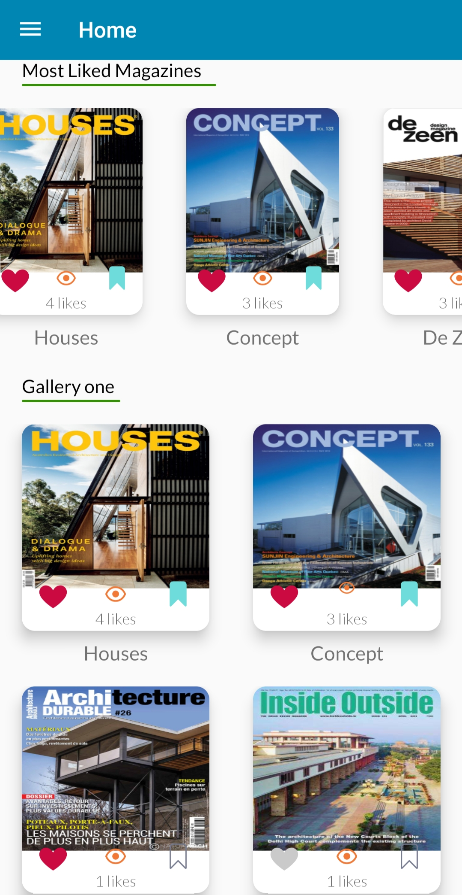
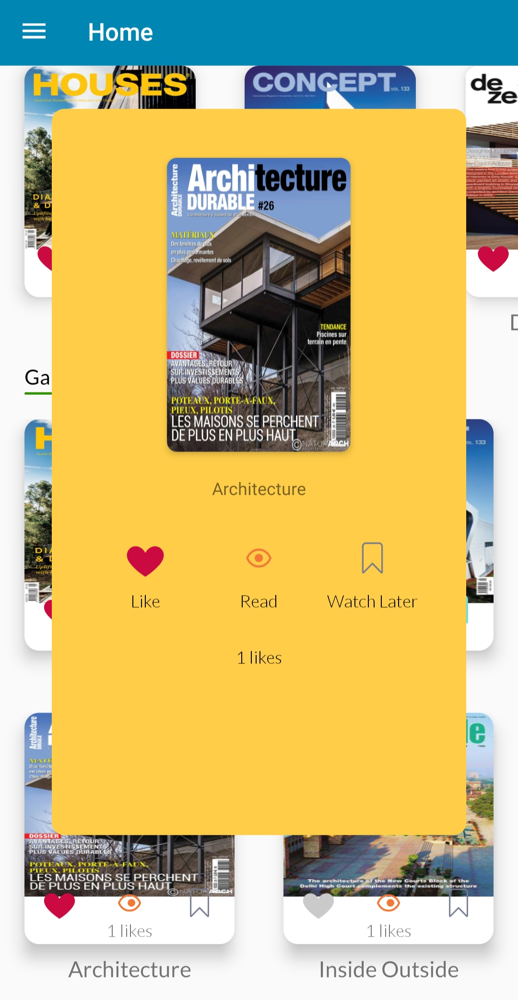
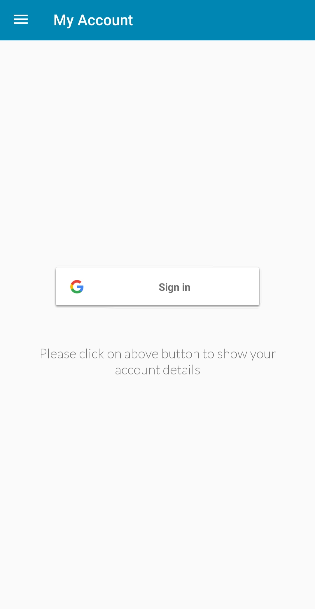
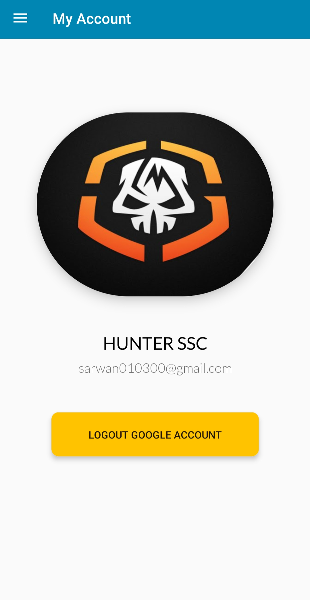
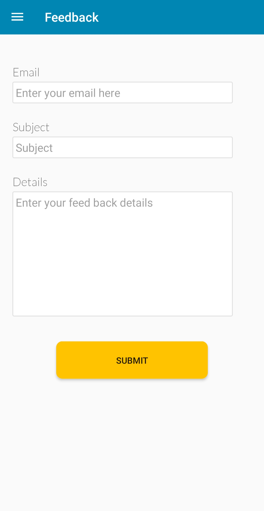

		E-Book Ardberry Technology Pvt. Ltd. App

Introduction
E-book Ardberry Technology Pvt. Ltd. app is a magazine showcase app which provides access to exclusive magazines available on beautiful architecture and facades. E-book App lets you like your favorites, bookmark to read later and give exclusive access to latest magazines. E-book app is filled with many animations and an awesome colorful theme providing user a quite unique and decent experience.

List of Activities
•	Home Activity
•	PopUp Activity
•	Account Activity
•	Feedback Activity
•	Inside Book Activity

About Activities

1. Home Activity
•	Most liked books automatically shuffled on the basis of like counts. This is done with using getChildCount () function of firebaseDatabase. 
•	Amazing gallery slider with text under picture and dots under picture on the basis of current picture visible. This is done with the help of Daimajia Slider library.
•	User can like any book on their personal preference. Dynamic like calculator is also giving user a good user experience. Likes are stored in firebase real-time database on the basis of userId and book number.
•	User can bookmark any book on their personal preference. Bookmark status' are stored in firebase real-time database and is highly flexible while testing.
•	Likes and bookmarks are even visible in PopUp activity. This is done by sending the current books like and bookmark status.
•	Numerous types of galleries are available to differentiate between different types of magazines.
•	User cannot like or bookmark any of the magazines without login. User will be directed to Account activity if user try to like or bookmark the magazine. However user can take a look on magazine even if he/she isn't logged in.
•	Touch sensitive navigation bar which make user to switch between activities. This is done with the help drawer layout, toolbar, and actionbar in xml and java files.

	 &nbsp;&nbsp;&nbsp;&nbsp;&nbsp;&nbsp;&nbsp;&nbsp;&nbsp;&nbsp;&nbsp;&nbsp;&nbsp;&nbsp;&nbsp;&nbsp;&nbsp;
   &nbsp;&nbsp;&nbsp;&nbsp;&nbsp;&nbsp;&nbsp;&nbsp;&nbsp;&nbsp;&nbsp;&nbsp;&nbsp;&nbsp;
 		 

2. PopUp Activity
•	A flexible dynamic overlay morale when clicked on any of the magazine. This is done with the help of DisplayMetrics Predefined class.
•	Popup Activity contains cover of the magazine, like status, like count, and bookmark status of that particular magazine. These values and URL are imported by receiving current book values sent when clicked on magazine in Home activity.
•	Likes and bookmarks in the popup layout provides the user to interact with magazine with a better user interface and dynamic user experience.

        &nbsp;&nbsp;&nbsp;&nbsp;&nbsp;&nbsp;&nbsp;&nbsp;&nbsp;&nbsp;&nbsp;&nbsp;&nbsp;&nbsp;&nbsp;&nbsp;&nbsp;
   &nbsp;&nbsp;&nbsp;&nbsp;&nbsp;&nbsp;&nbsp;&nbsp;&nbsp;&nbsp;&nbsp;&nbsp;&nbsp;&nbsp;

3. Account Activity
•	My Account activity lets the user to log in using Google account providing a simple and fast authentication of his/her account.
•	All loading screen animations are implemented using Lottie animations. This is done by adding Lottie animations gradle lines and JSON file of animation used inside assets folder.
•	User sign in and user logout are done with the help of googleSignIn Class.
•	User information like user information, email, and userId are stored in firebase real-time database which helps identify each user in a unique way.

	 &nbsp;&nbsp;&nbsp;&nbsp;&nbsp;&nbsp;&nbsp;&nbsp;&nbsp;&nbsp;&nbsp;&nbsp;&nbsp;&nbsp;&nbsp;&nbsp;&nbsp;
   &nbsp;&nbsp;&nbsp;&nbsp;&nbsp;&nbsp;&nbsp;&nbsp;&nbsp;&nbsp;&nbsp;&nbsp;&nbsp;&nbsp;
 		 

4. Feedback Activity
•	Feedback Activity is used to interact with user and get views and suggestions which we can further implement in app.
•	Feedback submitted by user is stored in Feedback_user node in firebase real-time database. 

	 &nbsp;&nbsp;&nbsp;&nbsp;&nbsp;&nbsp;&nbsp;&nbsp;&nbsp;&nbsp;&nbsp;&nbsp;&nbsp;&nbsp;&nbsp;&nbsp;&nbsp;
   &nbsp;&nbsp;&nbsp;&nbsp;&nbsp;&nbsp;&nbsp;&nbsp;&nbsp;&nbsp;&nbsp;&nbsp;&nbsp;&nbsp;
 		 

5. Inside Book Activity
•	Inside book activity is run whenever eye animation icon is clicked from home activity or popup activity.
•	Which magazine is to be displayed is automatically selected by app on the basis of the book the eye animation is issued to. This is done by sending extra data whenever the intent is run.
•	Loading the magazine is done by downloading the magazine from URL in a file stream and then run in pdfViewer library using fromStream () function.
•	No magazines are stored in the internal storage of user which maintains the privacy.

	 &nbsp;&nbsp;&nbsp;&nbsp;&nbsp;&nbsp;&nbsp;&nbsp;&nbsp;&nbsp;&nbsp;&nbsp;&nbsp;&nbsp;&nbsp;&nbsp;&nbsp;
   &nbsp;&nbsp;&nbsp;&nbsp;&nbsp;&nbsp;&nbsp;&nbsp;&nbsp;&nbsp;&nbsp;&nbsp;&nbsp;&nbsp;
 	 

Problems Faced
•	Complex layout lead to lags and shuttering in low profiles phones which was further resolved by converting one layout and 3 and importing in 4th layout.
•	Likes and bookmarks when clicked by 2 simultaneous calls of valueChangeListener resulted in firebase crash and app freeze. This was resolved by changing valueEventListener to addSingleValueListener which resulting in only single work at a time and closing all listeners after the work.
•	Layout bugs which resulted in crash or layout deformities in low profile phones. This was resolved by simplifying layout in a standard manner.
•	Running pdf from a firebase download URL was complex as many libraries doesn't support https links. This was resolved by downloading and storing content in file stream which are further processed by pdfviewer using fromStream () function.
•	Likes and bookmarks of most liked magazines should be dynamic and making it worl properly took lots of time.

Things to Do In Future
•	Testing on more devices.
•	Implementing PDF display in a more memory saving way which can save a lot of memory and time at the PDF loading instance.
•	About Us Section to let user know about developers and company.
